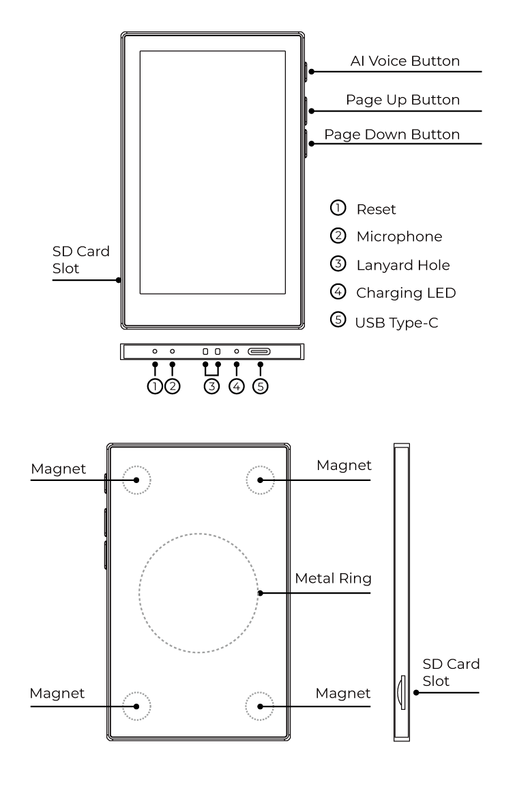

# Enclosure layout

Where holes and keys sit on the card. Electrical nets stay in
[pin-map.md](pin-map.md). This page is Seeed's appearance diagram, vendored
at [resources/enclosure/appearance_en.png](../resources/enclosure/appearance_en.png)
([SOURCE.md](../resources/enclosure/SOURCE.md)).

**Default orientation** (matches the diagram's front view): glass facing you,
USB-C on the **bottom** short edge. Left/right/top/bottom below use that pose.
Do not describe keys as being on the glass.

## Front (glass)

The large rectangle is the **e-paper panel** with GT911 capacitive touch under
the glass. Tapping it is the touch step, not `btn 4` / `5` / `6`.
embassy-debug printed `touch n=` through **5**
([touch.md](touch.md#on-glass-embassy-debug)).
simple-debug operator never printed `contacts=` on its own poll path.
There is no frontlight.

## Right long edge (three tactile keys)

On the appearance diagram they sit in the **top half** of that edge
(AI Voice near the top of the glass; Page Down still above mid-height),
not spaced along the full card.

Top to bottom:

| Seeed label | Firmware GPIO | UART token |
| --- | ---: | --- |
| **AI Voice Button** | 4 (`BUTTON_OK`, AI / OK / power, `ext1` wake) | `btn 4` |
| **Page Up Button** | 5 (`BUTTON_UP`) | `btn 5` |
| **Page Down Button** | 6 (`BUTTON_DOWN`) | `btn 6` |

GPIO names are firmware claims; the column on the left is the diagram. Stock
firmware: ~3 s hold of the AI Voice Button powers on; both page keys held ~1 s
requests power off (application policy).

## Left long edge

**SD Card Slot** (MicroSD). SPI shared with the panel; do not mount a card
from an operator UART session. Detect is GPIO11.

## Bottom short edge (USB-C edge)

Left to right in the diagram (numbered 1–5):

| # | Seeed label | Notes |
| --- | --- | --- |
| 1 | **Reset** | Recessed pinhole. Hardware reset (`CHIP_PU`), **not** a GPIO. Do not treat it as a key in an operator button session. |
| 2 | **Microphone** | PDM capsule hole. Clock GPIO19, data GPIO20, enable GPIO38. |
| 3 | **Lanyard Hole** | Mechanical only. |
| 4 | **Charging LED** | Dual-color, charger-driven, not an MCU GPIO. While STAT was low the operator saw green/yellow. Off / done color unconfirmed. |
| 5 | **USB Type-C** | Power, CH343P UART (QinHeng `1a86:55d3`), ROM download. Not native USB-Serial/JTAG. |

## Rear

Four **corner magnets** (N52) and a central **metal ring** for the adhesive
mount. Magnets can snap to a desk or fridge while a USB cable is attached.

## Side profile

Thin card. SD slot is toward the bottom of the left long edge in that view.
The buzzer (GPIO48) has **no** hole on this diagram; it is internal.

## What this drawing is not

- Not a pinout. It does not assign GPIO numbers; those come from
  firmware and schematic Rev 01 ([pin-map.md](pin-map.md)).
- Not a schematic. GPIO7 (shared INT1/GPOUT), SD detect (insert = 0),
  STAT, and the charger-driven charge LED live on that sheet, not here.
- Not permission to invent a fourth key or a front-face button.
