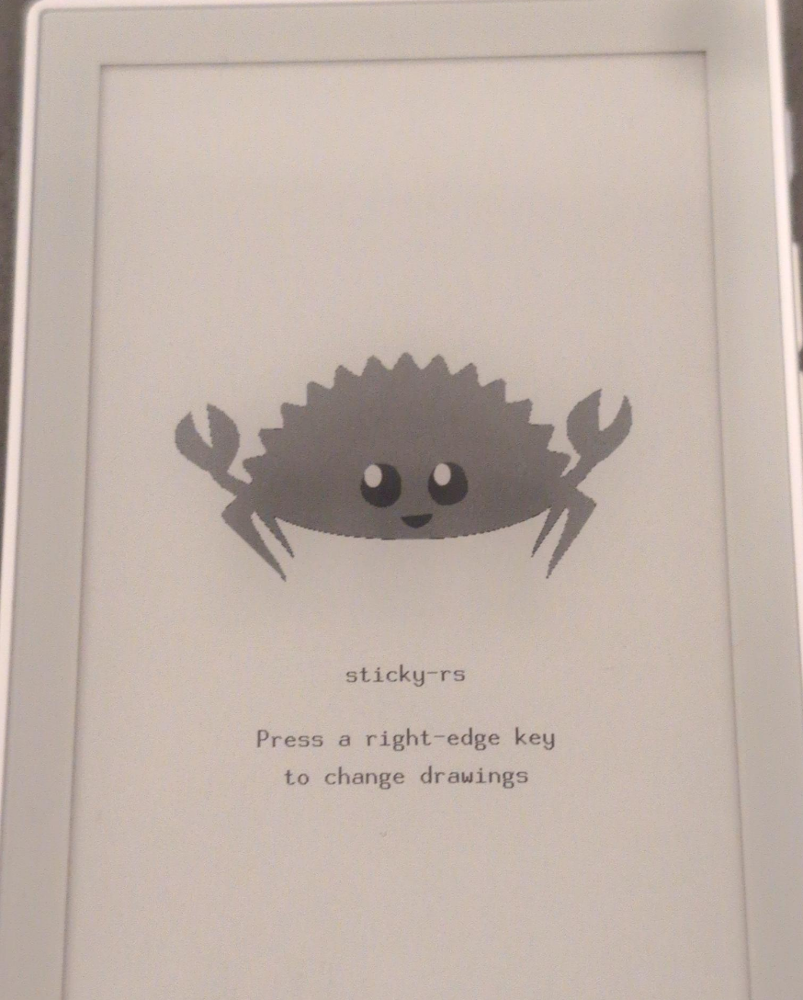

# `sticky-rs`

> **Embedded Rust Tooling & Crates for the [Sticky](https://www.seeedstudio.com/sticky/docs/)**

> [!NOTE]
> I do have a "functioning" Embedded Rust dev environment for the Sticky,
> but I'm porting it over to clean git history slowly.
>
> This is an "agent copy from private repo", so needs some polish still.

## Seeed Studio reTerminal Sticky in Rust

- Host tools are: `cargo xtask` over `host/sticky-host`.
  - The goal here is that we can create a `sticky-cli`, but for now,
    `cargo xtask` is more efficient for development.
- **Read [docs/SAFETY.md](docs/SAFETY.md) before flashing or probing a unit.**
  - A mistake can destroy factory NVS (per-unit RF calibration), the
    fuel-gauge OTP, or the panel.
- [Getting started](docs/getting-started.md) (host verify, Xtensa, firmware
  install & run).
- [Snapshot HOWTO](docs/firmware-snapshot-management.md).
  - I highly recommend snapshotting the original firmware, before first use.
- [Hardware details](.agents/skills/seeed-sticky-hardware/SKILL.md).
  - The pin map, rails, vendoring of datasheets, etc.
- All other relevant and useful docs, should live in [`docs/`](./docs)

> [!IMPORTANT]
>
> Anything we haven't written a test for to confirm behavior is likely
> still misaligned. We keep a list of ["Not yet confirmed"](https://github.com/canardleteer/sticky-rs/blob/main/.agents/skills/seeed-sticky-hardware/resources/not-yet-confirmed.md#not-yet-confirmed)
> measurements, so we can continue building tests.

## Firmware Examples

  

- [plain](./firmware/simple-debug)
  - [quick install](./docs/getting-started.md#path-a--without-embassy-simple-debug)
- [embassy-rs](./firmware/embassy-debug)
  - [quick install](./docs/getting-started.md#path-b--with-embassy-embassy-debug)

## cargo xtask

From the repo root (`cargo xtask <subcommand>`). `cargo xtask --help` lists
flags.

Live commands take `--port` or `ESPFLASH_PORT`; if unset they need
exactly one QinHeng CH343 (`1a86:55d3`).

| Command | UART? | Summary |
| --- | --- | --- |
| `detect-connected` | no, unless `--probe` | List Sticky CH343 nodes. `--probe` opens the UART |
| `backup-factory-firmware` | live dump yes; `--import` no | Classify then store: known factory → `developer-data/backups/original/<serial>/` (write-once, then sealed read-only); else `--name` capture under `developer-data/backups/captures/<unit-id>/<slug>/`. Alias `backup-firmware`. `--as-original` for uncertain stock under `original/`. `--import` refuses `--port` |
| `confirm-factory-firmware` | yes | Compare live flash to that unit's original, or `--capture SLUG` |
| `restore-factory-firmware` | yes | write-bin that unit's original or `--capture` (`--yes`). Never a full-chip erase |
| `flash-app` | yes | write-bin `--image FILE` into factory `app0` only. Needs a matching original or capture. Does not compile |
| `learn-uart` | yes | UART heartbeat vet plus skippable human steps |
| `learn-uart-only` | yes | Same session, only named groups |
| `diff-learn-uart` | no | Host-only compare of two reports or factory serials |
| `vet-idle-log` | no | Host-only. Check a `monitor` capture for unattended embassy-debug or simple-debug tokens |
| `build-fw` | no | Host-only. `cargo +esp` + `save-image` for `simple-debug` or `embassy-debug`. `--features operator` / `mic` / `radio` / `pair` / `spi20` / `sd` / `charge` |
| `ci` | no | Host-only CI gate (fmt, host clippy/test, firmware clippy, rumdl, machete, audit) |
| `monitor` | yes | UART0 at 115200 |

## License

Sources in this repository are licensed under the MIT license. See
[LICENSE](LICENSE).

Seeed, reTerminal, Sticky, Espressif, and other product or company names are
trademarks of their respective owners. This project does not claim those
marks or their copyrights, and is not affiliated with or endorsed by those
owners.
