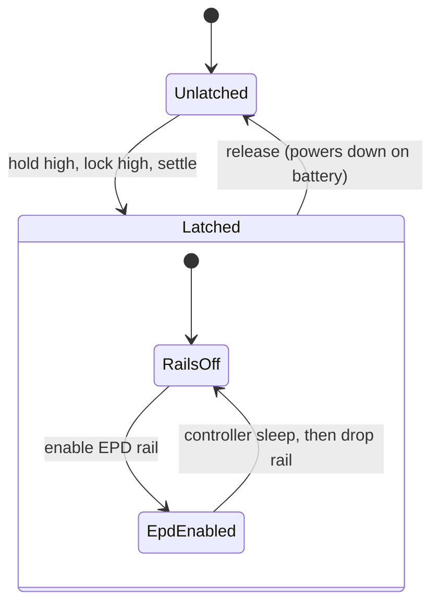

# API rules for crates written here

Derived from the Embedded Rust Book's
[HAL design checklist](https://docs.rust-embedded.org/book/design-patterns/hal/checklist.html)
and [design contracts](https://docs.rust-embedded.org/book/static-guarantees/design-contracts.html)
chapter, so "best practices" is a reviewable list rather than a sentiment.
Each rule below is auditable in review.

## Checklist

| Rule | What it means here |
| --- | --- |
| **C-CTOR** | One wrapper type per device, constructed from the buses and pins it owns. No extension traits on foreign types. |
| **C-FREE** | Every wrapper offers a destructor that consumes `self` and returns the bus and pins, leaving the device in a state where `new` can succeed again. |
| **C-HAL-TRAITS** | Implement the applicable `embedded-hal` traits. The display crate also implements `embedded-graphics-core`'s `DrawTarget` behind a default `graphics` feature. |
| **C-INLINE** | Mark small accessors `#[inline]`; cross-crate inlining is not automatic and code size matters on this part. |
| **C-PIN-STATE** | Encode device state as type parameters. Illegal sequences must not compile. |

Additional rules for this workspace:

- **No MCU dependency in a chip driver.** `crates/bq*` and
  `crates/ssd1677-gray4` depend on `embedded-hal` only. Anything ESP32-S3
  specific belongs in the board-support crate or the firmware.
- **Never lock a bus internally.** Take `SpiDevice` / `I2c` and let the caller
  compose sharing with `embedded-hal-bus` or `embassy-embedded-hal`. This board
  shares one SPI controller between the panel and the card, so bus arbitration
  is the application's decision.
- **Blocking and async from one source.** Where both surfaces exist, keep the
  register-level logic shared rather than forked.
- **`#![no_std]`, `#![forbid(unsafe_code)]`, `#![warn(missing_docs)]`.**
  Enforced through workspace lints.
- **Cite the datasheet in rustdoc** for every register, opcode, and magic
  number, including the document revision. A constant without a citation is a
  bug: see the
  [datasheet catalog](DATASHEETS.md).
- **Do not invent registers.** If a datasheet has not been read, expose a
  documented raw primitive instead of a typed accessor built on a guess, and
  record the gap in that catalog.

## Typestate, and where it earns its keep

Typestate is not decoration here; it maps onto the four hazards most likely to
destroy this board. See [SAFETY.md](SAFETY.md).

- A `Latched` witness gates every bus and rail constructor, so "talk to a
  peripheral before latching power" cannot be expressed.
- `EpdRail<Enabled>` gates controller commands, and reaching `Disabled`
  requires having issued the deep-sleep command.
- `Charger<Disabled>` is the only state `new` returns, and the active-low
  detail of `/CE` is unreachable from outside.
- Gauge writes need a feature flag *and* an explicit unseal type; neither alone
  is enough.

Keep the board-support crate thin: it owns pins, constants, transforms, and
sequencing. It is not a second abstraction layer over `esp-hal`.

## Testing rules

- Register-level tests are `embedded-hal-mock` transaction scripts derived from
  datasheet tables, not from observed traffic.
- Sequencing tests assert **order and polarity** — the two failure modes that
  brick a board or silently mislead.
- Geometry and packing are pure functions with exact expected byte counts.
- Prefer a failing test that encodes a datasheet claim over a comment
  describing it.
