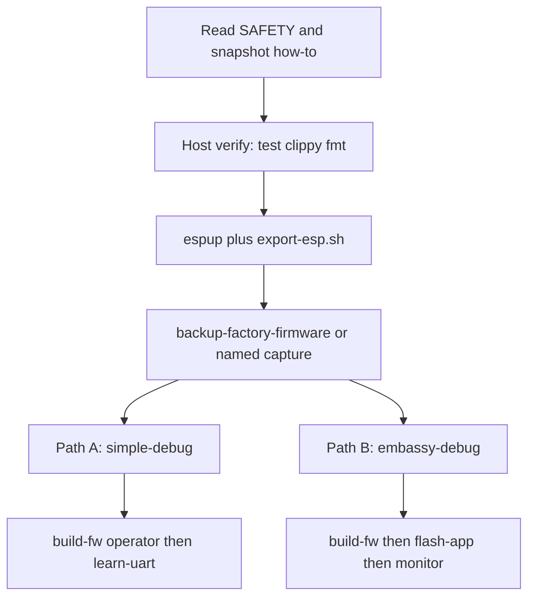

# Getting started

Fresh-start how-to for this repository: host verify, the Xtensa toolchain,
a snapshot of **your** unit, then either firmware path.

Read [SAFETY.md](SAFETY.md) before flashing or probing. Snapshot how-to:
[firmware-snapshot-management.md](firmware-snapshot-management.md). Image
envelopes and UART line formats live in the firmware READMEs — do not
treat this page as a substitute.



## Four rules

In the order you are most likely to regret breaking them:

1. **Never erase the flash.** No `espflash erase-flash`, no full-chip erase.
   Do not write below `0x90000` except `cargo xtask restore-factory-firmware`
   of **that same unit's** original or `--capture`. The factory NVS holds
   per-unit Wi-Fi RF calibration, device identity, and persisted gauge
   state. Lost `nvs` is not regenerable. Capture once with
   `cargo xtask backup-factory-firmware` before any custom image
   (known factory → write-once `original/`; already-flashed units need
   `--name`). Layout id `factory-32mb-v1`.
2. **Do not invent an e-paper waveform.** This panel’s confirmed path is
   Seeed **OTP** sequences, not a generic 105-byte table. A table from
   another SSD1677 board can stress the glass. Details:
   [ssd1677.md](ssd1677.md).
3. **Do not write to the fuel gauge.** Reads are safe. Unseal and
   data-memory writes are not, and the OTP is one-time.
4. **Latch power before anything else, and release it deliberately.**
   GPIO45 then GPIO46 high. Dropping the latch on battery powers the
   board off.

Full hazard table: [SAFETY.md](SAFETY.md).

Host I/O is `cargo xtask` only. Do not open a UART unless a human asked.
There is no Cargo `runner`, so `cargo run` cannot flash.

## The workspace (host, no special toolchain)

```shell
cargo test --locked
cargo clippy --locked --all-targets -- -D warnings
cargo fmt --check
```

This is the default host trio for `crates/*` and the host tools: they are
host-testable, so no target hardware, cross toolchain, or serial port is
involved. Firmware packages are workspace members but not default-members,
so these commands skip them. Do not pass `--workspace` (that pulls Xtensa).
`cargo xtask ci` is the full gate (that trio plus feature variants,
firmware clippy, rumdl, machete, and audit).

## The firmware (Xtensa)

`firmware/simple-debug` and `firmware/embassy-debug` target
`xtensa-esp32s3-none-elf`, which needs the Espressif toolchain because
Xtensa is not an upstream rustc target. `simple-debug` is blocking `esp-hal`
only. `embassy-debug` uses `esp-rtos` / Embassy. Build from the **repo
root** — there is no per-image `.cargo/config.toml`.

```shell
cargo install espup --locked
espup install                       # installs the `esp` toolchain + Xtensa GCC
. $HOME/export-esp.sh               # required in every new shell
```

`--features operator` is only on `simple-debug-fw`. Do not pass it to a
host `cargo build`.

The result is an ELF and `save-image` payload at
`target/xtensa-esp32s3-none-elf/release-fw/simple-debug-fw` /
`simple-debug.bin` (or `embassy-debug-fw` / `embassy-debug.bin`).
A linker warning about `a LOAD segment with RWX permissions` is expected for
esp-hal images and is not a problem.

Equivalent without xtask:

```shell
cargo +esp build -p simple-debug-fw --profile release-fw --locked \
  --target xtensa-esp32s3-none-elf -Zbuild-std=core,alloc --features operator
```

### Snapshot first

Once per unit, before `flash-app` or `learn-uart`:

```shell
cargo xtask backup-factory-firmware
# already-flashed unit:
# cargo xtask backup-factory-firmware --name after-flash
```

`flash-app` refuses without a matching original or capture. If more than
one USB-serial device is present, set `ESPFLASH_PORT` to the Sticky CH343
(`cargo xtask detect-connected` prints a by-id suggestion). Do not commit
`developer-data/`.

### Path A — without Embassy (`simple-debug`)

Blocking `esp-hal` proof-of-life and the `learn-uart` operator format.

```shell
. $HOME/export-esp.sh
cargo xtask build-fw simple-debug --features operator
cargo xtask learn-uart \
  --image target/xtensa-esp32s3-none-elf/release-fw/simple-debug.bin \
  --yes \
  --restore-app0
```

Omit `--features operator` for the quieter 1 s heartbeat image. Or flash
and watch without prompts: `flash-app` then `monitor`. Envelope, UART
lines, and restore:
[firmware/simple-debug/AGENTS.md](../firmware/simple-debug/AGENTS.md).

### Path B — with Embassy (`embassy-debug`)

Embassy event logger. The panel refreshes (splash, then GPIO5 / GPIO6
cycle splash / shapes / legend / four-tone boxes).

```shell
. $HOME/export-esp.sh
cargo xtask build-fw embassy-debug
cargo xtask flash-app --image target/xtensa-esp32s3-none-elf/release-fw/embassy-debug.bin --yes
cargo xtask monitor
```

Unattended you should see `embassy-debug: latched`, a GT911 ACK, then an
IMU line about every 5 s. Buttons, glass, and tilt add `btn` / `touch` /
pose lines and a short beep. Page Down reaches the four-tone boxes
(`scene=tones`). Full sequence and restore:
[firmware/embassy-debug/AGENTS.md](../firmware/embassy-debug/AGENTS.md).

`flash-app` writes a `.bin`; it does not compile. If the build fails, do
not flash a leftover ELF. (`esp_app_desc!()` is required; do not
`--merge`.)

## Troubleshooting

Three failure modes look like a code bug and are not:

| Symptom | Cause |
| --- | --- |
| `rustc 1.x is not supported by the following packages: esp-hal@1.2.0-rc.0 requires rustc 1.95.0` | The `esp` toolchain is older than esp-hal needs. Run `espup update`. Verified working: Xtensa Rust `1.97.0.0` |
| `linker 'xtensa-esp32s3-elf-gcc' not found` | `. $HOME/export-esp.sh` was not sourced in this shell |
| `none of the selected packages contains this feature: operator` | Host `cargo build --features operator` (crate `simple-debug`). Pass `-p simple-debug-fw` or use `cargo xtask build-fw simple-debug --features operator` |
| `cannot find module or crate xtensa_lx` (`esp-sync`) | Built without `--target xtensa-esp32s3-none-elf` and `-Zbuild-std=core,alloc`. Use `cargo xtask build-fw`. Ignore a leftover ELF from a failed `cargo` |
| `failed to load manifest for workspace member .../library/std` | The toolchain's `rust-src` is incomplete, usually from an interrupted `espup` run. Reinstall it, or extract `rust-src-<version>.tar.xz` from the matching [esp-rs/rust-build release](https://github.com/esp-rs/rust-build/releases) over `~/.rustup/toolchains/esp/lib/rustlib/src/rust` |

One workspace lockfile is committed. `cargo +esp` and `build-fw` pass
`--locked`. Confirm the lockfile still matches (compiles nothing):

```shell
cargo metadata --locked --format-version 1 --no-deps
```

## Status

The `no_std` crates are tested against `embedded-hal-mock` transaction
scripts and datasheet register tables. They have **not** been exercised on
the buses.

`firmware/simple-debug` cross-compiles for `xtensa-esp32s3-none-elf`.
`cargo xtask flash-app` loads it into factory `app0` (latch, UART0;
**no** panel refresh). The image heartbeats raw GPIO, gauge, and IMU
levels.

`firmware/embassy-debug` is a separate Embassy image (workspace member, not
a default-member): latch, timestamped button / touch / IMU lines, a
buzzer, and the panel (including four-tone OTP gray4 boxes).

`cargo xtask` **has** talked to a Sticky: `detect-connected`, `--probe`,
`backup-factory-firmware`, `flash-app`, `monitor`,
`restore-factory-firmware --part app0`, and `confirm-factory-firmware`
(QinHeng `1a86:55d3`, udev by-id, EN/RTS run-mode UART sample, 32 MiB
chunked dump at 921600, app0 write-bin at `0x90000`). After restoring
factory `app0` (bring-up, then again after the UART learning image),
confirm matched the original. Full-chip restore has not been run.

Live UART commands take an exclusive session lock so a second xtask cannot
reset the chip mid-dump, mid-write, or mid-monitor (`detect-connected`
without `--probe` does not). `esptool flash-id` on the same UART confirmed
8 MB `AP_3v3` PSRAM and JEDEC `ef 4019`; `espflash board-info` omitted
PSRAM (a tool quirk, not missing silicon). Agents still do not invoke
xtask unless a human explicitly asks.

Compiling is not evidence about GPIO sequencing. A linked ELF says the
types and pin roles agree with `esp-hal`; it says nothing about whether
latch, display, or sleep is correct on real silicon.

Bus probes beyond the bring-up I2C/gauge pass, an EPD refresh, SD mount,
charge enable, latch timing, and sleep current remain human-approved work.

## Layout

| Path | What |
| --- | --- |
| [`crates/bq25616`](../crates/bq25616) | GPIO-only charger control (typed active-low enable) |
| [`crates/bq27220`](../crates/bq27220) | BQ27220 fuel gauge, read-only by default |
| [`crates/ssd1677-gray4`](../crates/ssd1677-gray4) | SSD1677 controller, dual-plane four-gray, OTP on Sticky |
| [`crates/seeed-reterminal-sticky`](../crates/seeed-reterminal-sticky) | Board support: pins, power latch, rails, transforms |
| [`crates/simple-debug`](../crates/simple-debug) | Host-tested UART heartbeat and GPIO edge line format |
| [`crates/embassy-debug`](../crates/embassy-debug) | Host-tested UART event lines for the Embassy image |
| `firmware/simple-debug` | ESP32-S3 proof-of-life. Workspace member, not a default-member |
| `firmware/embassy-debug` | ESP32-S3 Embassy event logger. Same membership; panel always on |
| `host/sticky-host/` | Host library: detect, factory backup, confirm, restore, `build-fw`, `flash-app`, learn-uart, monitor (`Layout` in; UART lock inside live methods) |
| `xtask/` | Clap front-end at the repo root (`cargo xtask`) over `sticky-host` |
| `developer-data/` | Gitignored private / personalized files. Sealed snapshots in `developer-data/backups/`; learn-uart YAML in `uart-inspection-records/<serial>/`; confirm reports in `confirm-records/<serial>/`; not in git |

The chip drivers are `#![no_std]`, depend only on `embedded-hal` 1.0, and
know nothing about ESP32-S3. Board specifics live in the board-support
crate.

Command list: [README.md](../README.md#cargo-xtask). Flag catalog:
[`.agents/skills/sticky-rs/references/xtask.md`](../.agents/skills/sticky-rs/references/xtask.md).

## Hardware documentation

The board contract lives in
[`.agents/skills/seeed-sticky-hardware/`](../.agents/skills/seeed-sticky-hardware/SKILL.md):
pin and bus map, power sequencing, display and touch geometry, sensor
addresses, flashing geometry, datasheet catalog, plus a measurement
backlog. When sources disagree, the skill user weighs them. Observed
hardware on this product outranks official board docs and chip
datasheets, which outrank third-party firmware.

Datasheet catalog (symlink into that skill): [DATASHEETS.md](DATASHEETS.md).
This repository’s host tools and crate layout:
[`.agents/skills/sticky-rs/`](../.agents/skills/sticky-rs/SKILL.md).
