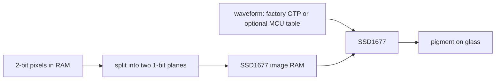

# SSD1677 on the reTerminal Sticky

How this repository drives the 800×480 black-and-white panel, why the sequence
looks the way it does, what we have confirmed, and what will damage the film
if you get it wrong.

Controller opcodes and timings: SSD1677 datasheet **Rev 1.0 (Nov 2018)**,
catalogued in the hardware skill
[datasheet catalog](../.agents/skills/seeed-sticky-hardware/resources/datasheets.md).
Board wiring (pins, 10 MHz SPI,
BUSY high, rail GPIO47): the hardware skill
[display.md](../.agents/skills/seeed-sticky-hardware/references/display.md).
When they disagree about a **register**, the datasheet wins. When they disagree
about a **pin**, the board contract wins.

Types: [`ssd1677-gray4`](../crates/ssd1677-gray4) (controller) and
[`seeed-reterminal-sticky::display`](../crates/seeed-reterminal-sticky/src/display.rs)
(this glass). A [glossary](#words-this-document-uses) is at the end.

## How e-paper works

An LCD holds an image by continuously driving liquid crystal. E-paper does not.
Each pixel is a tiny cell of charged pigment in fluid. Apply a voltage for a
measured time and the particles migrate; the pixel changes colour. Remove the
voltage and they **stay put**. That is why a finished frame needs no power, and
why a half-finished frame is a problem: there is no “refresh until it looks
right” the way there is on a phone.

The timed voltage recipe is the **waveform**. It is not “set this pixel to
gray 2.” It is “drive this particle this hard, for this many milliseconds,
maybe reverse, maybe hold,” often differently for black, white, and each
mid-gray, and often differently when the pixel is changing versus staying put.
The panel vendor matches that recipe to the film. A recipe from another module
can look fine for a day and then leave permanent ghosts, a ringing border, or
collapsed contrast. That damage is **cumulative and delayed**.

A full update takes seconds. The controller raises a **BUSY** pin while the
waveform runs. Interrupting it, cutting power mid-waveform, or clocking the bus
faster than this board’s shared SPI path likes are all ways to leave particles
in the wrong place.

## This panel, and why four grays need a trick

The Sticky’s screen is **mono film**: black pigment and white pigment, no red
ink, no frontlight. The native canvas is 800×480. Four gray levels (black, dark
gray, light gray, white) are a software/controller trick on that film, not a
fourth ink.

The **SSD1677** was designed as a black/white/**red** controller. It keeps two
one-bit images in RAM:

- command `0x24` — datasheet name “Black White” RAM
- command `0x26` — datasheet name “RED” RAM

For each pixel the two bits pick one of four waveform slots (the datasheet
calls them LUT0..LUT3 — look-up table index 0 through 3). On a red panel those
slots mean “black, white, red, …” On **this** glass there is no red, so the
same four slots become four **waveforms** that leave the particle at four
different gray levels. The controller has no “grayscale mode” bit. Dual-plane
writes plus a waveform that knows about those four slots **are** grayscale.

That is why the plane mapping and the waveform are one design. If you invert
the bits in RAM but keep the other product’s waveform, black and white swap
(or worse). Seeed’s builder takes two-bits-per-pixel data, sends the high bit
to `0x24` and the low bit to `0x26`, then **inverts** both because this
panel’s factory waveform treats `1` as white. That mapping is
`PlaneMapping::SEEED_OTP`. Do not pair it with a microcontroller-written
105-byte table, and do not pair datasheet-order `LUT_INDEX_ORDER` with this
panel’s factory gray4 path.



## Where the waveform lives

The SSD1677 can get a waveform from two places. They are alternatives, not
layers you stack.

**Factory OTP (one-time programmable memory) on the panel.** The glass vendor
burns the recipe into the module before it ships. Firmware does **not**
download 105 bytes of waveform. It tells the controller which stored sequence
to run (`Display Update Control 2`, command `0x22`), then `Master Activation`
(`0x20`). Analog rails (gate / source / common voltage, commands `0x03` /
`0x04` / `0x2C`) come up with that stored recipe. Seeed’s open `seeed_epaper`
driver and the stock Sticky image both use this path. There is no `0x32`
write.

**A microcontroller look-up table (MCU LUT).** Command `Write LUT register`
(`0x32`) accepts **105 bytes** from the chip that is talking SPI. That table
is panel data: voltages, pulse widths, frame rate. The controller will not
tell you what is safe; the datasheet will not invent this glass’s table. A
table from a different SSD1677 module (including FreeInk’s Sticky file, which
is **absent** from stock `app0`) stays commented in this repository. This
crate will accept an attributed [`Lut`](../crates/ssd1677-gray4) if a caller
has a licensed table from the panel vendor, recorded in this document. It
**ships none**.

On the Sticky, “drive the panel” means the OTP path. “Do not invent a
waveform” means do not fill in a 105-byte table, and do not guess analog
bytes to go with one.

### There is no “measure the glass and uncomment” path

Commented FreeInk bytes are a **negative** record: they are not in stock
`app0`, and Seeed never sends them. They are not a to-do.

This repository cannot dump a factory waveform. The SSD1677 does not read the
OTP table back over SPI. `cargo xtask` talks to the CH343 UART and flash, not
the panel. Host tests never drive glass. Firmware symbols prove **command
order**, not voltages on the film.

What *can* still be confirmed is electrical identity — glass part number and
named analog rails — from a schematic, BOM, or marking
(`nyc-panel-glass` in the hardware skill). That still does not produce a
105-byte `0x32` table, and it is not permission to uncomment one.

Leave those constants commented. Compiling a microcontroller look-up table
would take a licensed vendor source recorded in
the hardware skill
[datasheet catalog](../.agents/skills/seeed-sticky-hardware/resources/datasheets.md),
not a local experiment.

## How a Sticky update runs, and why each step is there

1. **Latch power, then raise the panel rail (`EPD_EN`, GPIO47).** The board
   dies on battery if the latch is low. The controller has no power until the
   rail is up.
2. **Park MicroSD chip-select.** Display and card share one SPI controller.
3. **SPI at 10 MHz, mode 0.** The controller’s write max is 20 MHz; 40 MHz
   profiles exist for other products and have been flaky on this shared bus.
4. **Hardware reset, then talk.** `Ssd1677::new` pulses reset. A software
   reset (`0x12`) is sent only on a **full** refresh so that partial and gray4
   can keep RAM for a comparison frame.
5. **Booster soft-start (`0x0C`) `BoosterSoftStart::LEVEL_2`.** Limits inrush
   while the high-voltage supplies come up. Seeed and stock firmware write
   this; they do **not** then write gate/source/VCOM.
6. **Write both RAM planes**, then pick a sequence:
   - **Full** black/white: `UpdateSequence::DISPLAY_MODE_1_WITH_TEMP` (`0xF7`), then `0x20`. Cold boot: white clear,
     because the last frame survives reset.
   - **Partial** black/white: `UpdateSequence::DISPLAY_MODE_2_WITH_TEMP` (`0xFF`), then `0x20`. Still a **panel-wide**
     waveform. Unchanged pixels stay put only if previous and new RAM match.
     A “dirty rectangle” that skips the comparison image will re-energize stale
     regions. Lotus independently documents the same fact.
   - **Four-gray:** `SEEED_GRAY4_TEMPERATURE` (`0x1A`, opaque panel
     bytes, not a °C we have converted), then `UpdateSequence::SEEED_GRAY4`
     (`0xD7`), then `0x20`.
     `SEEED_GRAY4` is Seeed/stock; it is not a named row in the Table 7-1 excerpt we
     extracted.
7. **Wait while BUSY is high** (seconds is normal). Do not send another
   command. `Master Activation` must finish.
8. **Deep sleep `0x10` = `DEEP_SLEEP_ENTER` (`0x03`)**, wait ~100 ms, then drop the rail. Datasheet
   Table 7-1 enters deep sleep only when those two bits are `11`. `0x01` is a
   no-op for sleep (Lotus/bb_epaper use it as “keep RAM”; this crate does not).
   BUSY stays high in deep sleep; that is not a hang.

Orientation on glass: draw 800×480, `rotate180_gray4`, controller `mirror_x`.
Seeed’s `mirror_x` flag bit-reverses plane bytes instead; pick one transform
stack and keep touch in lockstep.

## Safety: what “getting it wrong” does

Do not:

- Invent a 105-byte look-up table, copy a generic SSD1677 example, or use a
  table from a different product (Xteink X4 / GDEQ0426T82 is a different
  module).
- Clock the shared SPI bus at 40 MHz.
- Drop `EPD_EN` (GPIO47) while BUSY is high or before deep sleep (`0x10 =
  0x03`). Mid-waveform power cut is on the hazard list.
- Issue another command during Master Activation (`0x20`).
- Set `Driver Output control` `TB = 1`. The datasheet marks it reserved.
- Treat “partial” as a dirty rectangle that skips a comparison frame.
- Write gate/source/VCOM (`0x03` / `0x04` / `0x2C`) on the Sticky OTP path.
- Use deep-sleep parameter `0x01`.

Do:

- Latch power (GPIO45 then GPIO46) and raise `EPD_EN` before talking SPI.
- Park MicroSD chip-select before using the panel.
- Wait BUSY **high = busy** with a timeout of several seconds.
- After `0x10`, wait ~100 ms (Seeed) before cutting the rail.
- Cold-boot with a full **white** clear.

## What we confirmed (and how)

Three independent sources agree on the Sticky SSD1677 **OTP** path. An item is
“confirmed” only when at least two of these line up, or when the datasheet
alone specifies a parameter layout we then saw in Seeed’s driver:

| Source | What it is |
| --- | --- |
| SSD1677 Rev 1.0 Table 7-1 / Figure 9-1 | Opcode, payload length, `0x22` named sequences, booster levels, RAM addressing, deep sleep |
| Seeed `seeed_epaper` `driver/ssd1677.c` | Open driver for this panel class (E1005 / Sticky). [Lukilyy/reterminal-sticky-2048-eink-game](https://github.com/Lukilyy/reterminal-sticky-2048-eink-game) |
| Stock `reterminal_template` 1.1.0 `app0` | Same `seeed_epaper` / `ssd1677_init_base` / `ssd1677_refresh` symbols, booster bytes `AE C7 C3 C0 80` in read-only data next to `write softstart failed`, gray4 path `0x24` / `0x26` |

| Fact | Value | Confirmation |
| --- | --- | --- |
| Geometry | 800×480, 10-bit window `0..=799` / `0..=479`, **not** divided by 8 | Datasheet §8.3–8.5; Seeed `ssd1677_set_window`; crate tests |
| SPI | 10 MHz, mode 0, BUSY active high | On-glass; datasheet max 20 MHz |
| Booster `0x0C` | `BoosterSoftStart::LEVEL_2` | Table 7-1 Level 2; Seeed `softstart[]`; **stock app0** |
| Internal temperature sensor `0x18` | `TEMPERATURE_SENSOR_INTERNAL` (`0x80`) | Table 7-1; Seeed |
| Data entry `0x11` | `DATA_ENTRY_Y_INC_X_INC` (`0x03`, Y↑ X↑) | Table 7-1 power-on default; Seeed |
| Gate scan `0x01` `B[2:0]` | `GateScan::SEEED_STICKY` (`0x02`) | Seeed `driver_output[2]`; datasheet `TB=1` reserved |
| Gate lines | 479 (`0x01DF`) | Seeed `height - 1`; board `HEIGHT` |
| Full refresh `0x22` | `UpdateSequence::DISPLAY_MODE_1_WITH_TEMP` (`0xF7`) then `0x20` | Table 7-1 DISPLAY Mode 1 + temp; Seeed `SEEED_EPAPER_REFRESH_FULL` |
| Partial refresh `0x22` | `UpdateSequence::DISPLAY_MODE_2_WITH_TEMP` (`0xFF`) then `0x20` | Table 7-1 power-on / Mode 2 + temp; Seeed `PARTIAL` |
| Gray4 refresh `0x22` | `UpdateSequence::SEEED_GRAY4` (`0xD7`) then `0x20` | **Seeed + stock symbols only.** Not named in the Table 7-1 excerpt we extracted. |
| Gray4 temperature `0x1A` | `SEEED_GRAY4_TEMPERATURE` | Seeed comment `Force_temprature_EPD_by_OTP_Update`; two-byte layout from Table 7-1. Opaque; not converted to °C here |
| Border `0x3C` | full `border::FOLLOW_LUT1`, partial `border::VCOM`, gray4 `border::FOLLOW_LUT0` | Seeed `init_base`; bitfields in Table 7-1 |
| Deep sleep `0x10` | `DEEP_SLEEP_ENTER` (`0x03`), then ~100 ms | Table 7-1 `A[1:0]=11`; Seeed `ssd1677_sleep` |
| Planes | `0x24` current / `0x26` previous | Rev 1.0 section `6.5 RAM`; Seeed `write_image` / gray4 |
| Gray4 packing | 2 bits/pixel, most-significant bit first; bit1→`0x24`, bit0→`0x26`, **then invert** (OTP `1`=white) | Seeed `build_native_gray4_planes`; `PlaneMapping::SEEED_OTP` |
| Microcontroller look-up table `0x32` | **Not sent** on this path | Seeed `ssd1677.c` has no `0x32`; stock app0 does **not** contain the FreeInk 105-byte table |
| Analog `0x03`/`0x04`/`0x2C` | **Not sent** on this path | Seeed init never writes them; OTP carries analog |

Software reset (`0x12`): Seeed sends it only for **full** refresh so
partial/gray4 can keep RAM. `RefreshKind::software_reset` encodes that.

Standby vs sleep: stock firmware exports `ssd1677_standby` / `ssd1677_resume`
and a `driver standby not supported` error. The 2048 copy of `seeed_epaper`
does not implement those vtable slots. **Sequence unknown.** The crate still
has only `Active` / `Asleep`. Do not invent a standby command.

## Using the panel from Rust

```text
latch → EPD_EN high → Ssd1677::new (10 ms reset) →
RefreshKind::Full.controller_config() → init →
white full frame → start_update_sequence(kind.sequence()) → wait BUSY →
… later Partial or Gray4 (re-init with that kind; skip 0x12 on non-Full) →
sleep (0x10 = 0x03) → wait SLEEP_HOLD_MS → drop EPD_EN
```

Gray4: split with `PlaneMapping::SEEED_OTP`, write `0x24` then `0x26`, write
`SEEED_GRAY4_TEMPERATURE`, then `UpdateSequence::SEEED_GRAY4`. Do **not** mix `SEEED_OTP` with a
microcontroller `0x32` table, or `LUT_INDEX_ORDER` with OTP gray4 — they are
opposite polarities.

## Not confirmed (commented in code)

| Item | Where the bytes sit (commented out) | Why they stay commented |
| --- | --- | --- |
| FreeInk `lut_grayscale_sticky` 105-byte microcontroller table | `ssd1677-gray4` `lut.rs`, `seeed-reterminal-sticky` `display.rs` | Absent from stock app0; Seeed never sends `0x32`; FreeInk notes the voltage tail is per-module and that X4 numbers shift Sticky mid-grays |
| FreeInk analog tail `17 41 A8 32 30` | `ssd1677-gray4` `analog.rs` | Same; Seeed does not write `0x03`/`0x04`/`0x2C` |
| Auto-write `0x46`/`0x47` with `0xF7` | opcodes exist; init does not call them | Figure 9-1 vs Table 7-1 plane names disagree; Seeed skips both |
| `0x22 = 0xD7` bit-level meaning | used, documented as Seeed-only | Not in our Table 7-1 name list |
| Partial `0x22 = 0xFC` | `sequence.rs` (commented) | Lotus / bb_epaper EP397; Seeed/stock/ESPHome use `0xFF` |
| Gray4 `0x1A = 0x5A` (one byte) | `sequence.rs` (commented) | OpenDisplay / TRMNL EP397; Seeed writes `{0x67, 0x00}` |
| Data entry `0x11 = 0x01` | — | bb_epaper EP397; Seeed writes `0x03` |
| Display Update Control 1 (`0x21`) `{0x40,0x00}` / `{0x00,0x00}` | `sequence.rs` (commented) | Lotus / bb_epaper; Seeed OTP never sends `0x21` |
| Deep sleep `0x10 = 0x01` | — | Lotus / bb_epaper “RAM keep”; Table 7-1 sleeps only on `0x03` |
| Glass part number, analog set vs temperature bands | measurement backlog `nyc-panel-glass` | Electrical / bill of materials. Toolbox claims **GDEM0397T81P**; not confirmed |
| Vendor standby command sequence | — | Symbols exist; payload unread |

FreeInk’s Sticky **black/white** sequences (`0xF7` / `0xFF`, booster Level 2,
10 MHz in this repo) match Seeed. Their **microcontroller gray look-up table**
does not. Do not treat the FreeInk LUT file as factory data.

## Words this document uses

| Term | Meaning here |
| --- | --- |
| **Waveform** | The timed voltage recipe that moves pigment. Not an LCD framebuffer blit. |
| **OTP** | **One-time programmable** memory **on the panel**. Factory-burned waveforms. Not the fuel-gauge OTP, and not “optional.” |
| **MCU LUT** | A **look-up table** the **microcontroller** writes at runtime with command `0x32` (105 bytes). Optional in this crate; unused on Sticky. |
| **LUT0..LUT3** | Four waveform *slots* selected by the two RAM bits for each pixel. |
| **SPI** | Serial bus to the controller (clock, data, chip-select). |
| **BUSY** | Controller pin, **high = working**. Wait; do not cut power. |
| **EPD** | Electronic paper display; `EPD_EN` is the panel power rail. |
| **VCOM / VGH / VSH** | Analog voltages (common, gate high, source). OTP brings them up on Sticky; do not guess them. |
| **Partial refresh** | A shorter waveform, still panel-wide, that uses previous+new RAM so unchanged pixels are not driven like a full clear. |
| **Gray4** | Four gray levels packed as two bits per pixel. |
| **`app0`** | Factory flash partition that holds the stock application image we compared. |

## Crate map

| Type | Crate | Role |
| --- | --- | --- |
| `Command`, `Window`, `Lut` | `ssd1677-gray4` | Datasheet opcodes; optional microcontroller look-up table |
| `BoosterSoftStart`, `UpdateSequence`, `GateScan` | `ssd1677-gray4::sequence` | Table 7-1 parameter blocks |
| `AnalogVoltages` | `ssd1677-gray4::analog` | Optional; Sticky OTP leaves `None` |
| `PlaneMapping::SEEED_OTP` | `ssd1677-gray4::planes` | Vendor inverted gray4 |
| `RefreshKind` | `seeed-reterminal-sticky::display` | Full / Partial / Gray4 for **this** panel |

A waveform invented in an issue comment or copied from another SSD1677 board
does not become confirmed by being typed. This crate will not grow a default
table. A licensed vendor source, recorded in the provenance table in
the hardware skill
[datasheet catalog](../.agents/skills/seeed-sticky-hardware/resources/datasheets.md),
is the only route that would compile one in
— not uncommenting FreeInk after a bench experiment.
